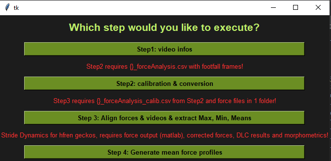

## required packages:
* numpy
* pandas
* opencv
* tk
* ffmpeg

## Description:
This script helps to automize the force data analysis. The program is divided into different modules/steps, which can be run 
independently of each other, though Step 2 requires the output of Step 1 + the manual inclusion of the footfall frames, 
and Step 3 the output from Step 2.
Step 4 allows the user to generate averaged force profile curves for each foot for each hfren individual, which 
requires some pre-arranged files (see description in the actual module).

The step gui looks like this:

### Step1:
* select Step1 in the gui
* open the folder in dialog which contains the videos of the lizard eg. .../Gecko01/videos_analysis
* when Step1 is finished, a .csv file (e.g. Gecko01_forceAnalysis.csv) containing all filenames, individual names, video information and 4 empty columns "footfall_begin", "footfall_end", "foot" and "notes will be saved into selected folder

---
**Now you need to add the frame numbers for the footfall and the foot (FL, FR, HR or HL) to this 
csv file. Take notes in the notes column if wanted, they will be transferred to final file. 
Save the file and close.**
---

### Step2:
* select Step2 in the gui
* open the folder in dialog which contains the videos of the lizard eg. .../Gecko01/videos_analysis

Note: *Gecko01* will be extarcted for the later filename, hence split[-2]. If all the videos are not in a subfolder, this split argument can be changed to [-1] to get the last part in the string as the later filename!
* a gui will be opened, showing the frame at mid footfall, which will tell you to:

  * 1st) draw a box around the forceplate by clicking on the first corner and dragging LMouseButton to the last corner. 

  * 2nd) Rightclick on the foot on the forceplate. Confirm with "c" or if you misdrew something reset with "r". Click "n" to get to the next video. An image of the drawn box and the footpoint on top of the frame will be saved in the selected folder/calib_footfall_labeled

The calibration gui looks like this:

* once all videos are done this will save a new csv: Gecko01_forceAnalysis_calib.csv containing all infos from the first file + the conversion factor, the coordinates of the box, the CoP of the forceplate, the point of the footfall, the conversion factor px to mm etc.

### Step3:
* select Step3 in the gui
This step uses the data frame from step 2 (e.g.: "Gecko01_forceAnalysis_calib.csv"), which includes frame count and frame
rate of each video, and aligns the videos with the respective force data...

Requires: folder with all force data .txt files which are names in the same way as it's saved in the data frame:
--> e.g.: gdub2_down_23.txt

All force data files for the geckos are stored in folder: forceData_geckos

### Step4: hfren average force profiles for stride dynamics analysis
!!This step requires a few pre-arranged files!!

* select the 4th option in the gui. 
  
This will run through all the force data strides for all hfren geckos if they are arranged in the file structure as 
expected. For more detail see the description in the module and the hfren_filename_matching_chart.csv.

This module generates the average force profile for each direction, individual and foot.

The process iterates through the extracted strides using the Gecko_force_sunc_output.txt file 
(which is the output from the Gecko_force_sync matlab script). 
It then gets the stride of focus and figures out matching force rows using the force collection parameters defined in the script
Then it calculates the average stride length of all strides and interpolates each stride to the same length.
These normalised strides will then be stored in a dictionary, one for each force_axis.
Finally, individual strides and the averaged force profiles are plotted as below:

